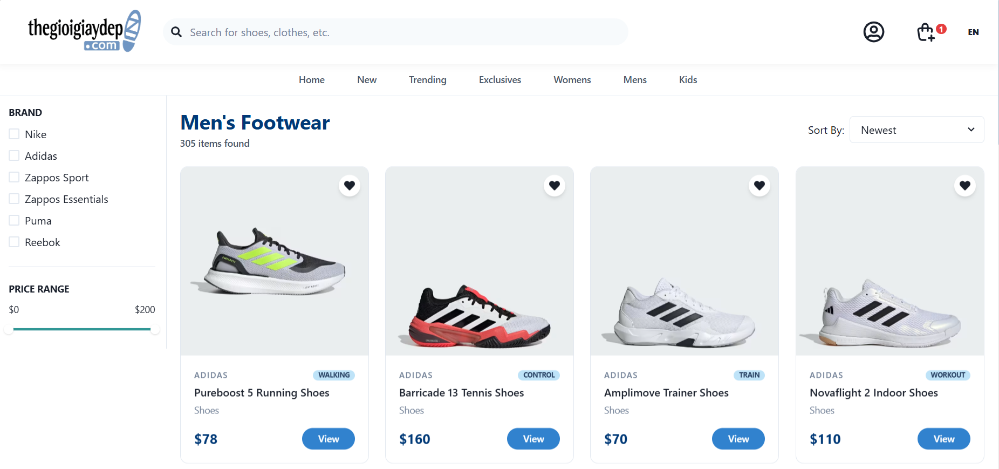

# 👟 Thegioigiaydep E-commerce Website

A high-fidelity, full-stack **E-commerce application**. This project features a robust catalog of over 2,000 products, a persistent cart system, real-time search with suggestions, and a premium, responsive UI.



---

## 🚀 Key Features

### 🛒 Core E-commerce
- **Massive Catalog**: 2,010 unique products imported from high-scale CSV datasets.
- **Smart Product Details**: Dynamic variant selection (Size/Availability).
- **Persistent Cart**: Unified cart system for both guest and authenticated users.
- **Order Lifecycle**: Complete flow from checkout to personalized order history.

### ⚡ Performance & Search
- **Live Suggestions**: Real-time search suggestions as you type, powered by MongoDB Text Indexing.
- **Optimized Rendering**: Memoized components and lazy-loaded images for battery-smooth scrolling.
- **Debounced Search**: Efficient API handling to minimize server load.

### 🎨 Visual Excellence
- **Luxury Design System**: Modern typography (Outfit font) and a premium palette.
- **Micro-Animations**: Elegant entrance and hover effects using `framer-motion`.
- **Mobile-First**: Fully responsive navigation with a sleek mobile hamburger menu.
- **Glassmorphism**: Translucent UI elements for a modern, high-tier feel.

---

## �️ Tech Stack

- **Frontend**: React.js, Chakra UI, Framer Motion, Axios, React Router.
- **Backend**: Node.js, Express.js, Mongoose.
- **Database**: MongoDB (with Text Indexing).
- **Auth**: JWT, Bcrypt.js.
- **Processing**: CSV Stream Analysis (for high-scale data import).

---

## ⚙️ Installation & Setup

Follow these steps to get the project running locally from scratch.

### 1. Prerequisites
- **Node.js**: v18+ recommended.
- **MongoDB**: A local instance or MongoDB Atlas cluster.
- **Git**: To clone the repository.

### 2. Clone the Repository
```bash
git clone https://github.com/kiennkt05/thegioigiaydep.git
cd thegioigiaydep
```

### 3. Backend Setup
Navigate to the server directory and install dependencies:
```bash
cd Server
npm install
```

Create a `.env` file in the `Server` directory:
```env
MONGODB_URL=mongodb+srv://<username>:<password>@cluster.mongodb.net/thegioigiaydep
SECREAT_KEY=your_very_secure_jwt_secret
PORT=3000
```

### 4. Data Population (Important)
The project includes scripts to import and seed product data.

#### Import Main Product Catalog
1. Place `shoes_dim.csv` and `shoes_fact.csv` in the `Server` directory.
2. Run the import script:
```bash
node importCSVData.js
```
*This will process approximately 300,000 variants into ~2,000 unique products with aggregated stock counts.*

#### Seed Featured Collections (New/Trending/Exclusives)
To populate the homepage sections (New Arrivals, Trending Now, and Birthday Exclusives) with curated sample data:
```bash
node seed.js
```
*This script links featured items to the main catalog for consistent product IDs and details.*

### 5. Frontend Setup
Open a new terminal, navigate to the client directory, and install dependencies:
```bash
cd Client
npm install
```

### 6. Run the Application

**Start the Backend Server:**
```bash
cd Server
npm run dev
```

**Start the Frontend App:**
```bash
cd Client
npm run dev
```

The application will be available at **`http://localhost:5173`**.

---

## 📂 Project Structure

- `/Client`: React frontend source code, styles, and assets.
- `/Server`: Express.js backend, Mongoose models, and data import logic.
- `/Server/importCSVData.js`: High-performance streaming data aggregator.

---

## 📄 License
This project is for educational purposes as part of a full-stack e-commerce portfolio.
